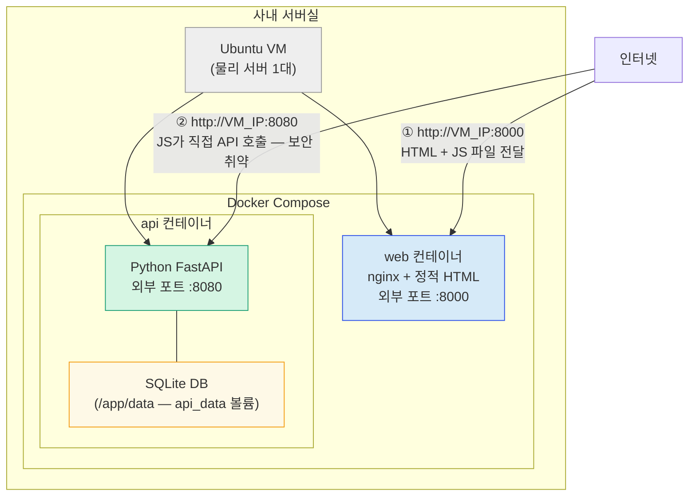
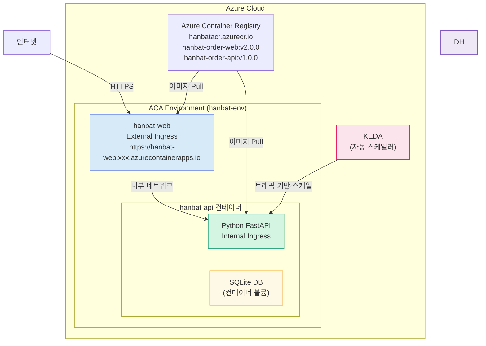

개요
읽기 10분

# AS-IS vs TO-BE 아키텍처

이번 실습에서 우리가 무엇을 어떻게 바꾸는지 전체 그림을 먼저 파악합니다.

---

## AS-IS — 사내 서버 구조

### AS-IS 특징

| 항목 | 내용 |
|------|------|
| 인프라 | Ubuntu VM 1대 (사내 서버실) |
| 오케스트레이션 | Docker Compose |
| Web 접근 | `http://VM_IP:8000` |
| API 접근 | 브라우저 JS가 `http://VM_IP:8080` 으로 직접 호출. 포트 8080이 외부에 노출 (보안 취약) |
| 언어 | Web: nginx + HTML/JS / API: Python FastAPI |
| 스케일 | 수동, 포트 충돌로 사실상 불가 |
| 배포 방식 | `docker compose up -d` → 컨테이너 재생성 → 다운타임 발생 |

!!! warning "AS-IS의 보안 문제"
    nginx는 HTML/JS 파일만 전달하고, 브라우저가 받은 JS가 API 서버를 직접 호출하는 구조입니다. 이 때문에 API 포트 8080을 외부에 열 수밖에 없고, 누구나 `http://VM_IP:8080/orders?userId=3030` 을 직접 호출해 데이터를 볼 수 있습니다. ACA 이관 시 **Internal Ingress**로 이 문제를 해결합니다.

---

## TO-BE — Azure Container Apps 구조

### TO-BE 특징

| 항목 | 내용 |
|------|------|
| 인프라 | Azure Container Apps (완전 관리형) |
| Web 접근 | External Ingress — HTTPS 자동 발급 |
| API 보안 | Internal Ingress — 외부 직접 접근 차단 |
| 스케일 | KEDA 기반 자동 스케일 아웃/인 |
| 배포 방식 | Revision 기반 무중단 배포, Traffic Split 지원 |

---

## 두 구조 비교

| 비교 항목 | AS-IS (Docker Compose) | TO-BE (ACA) |
|-----------|------------------------|-------------|
| 배포 중단 | 컨테이너 재생성 시 다운타임 | 0초 (무중단) |
| 스케일 | 포트 충돌로 사실상 불가 | 자동 스케일 아웃/인 |
| 점진적 배포 | 불가 | Traffic Split 지원 |
| API 보안 | 외부 노출 (취약) | Internal Ingress (안전) |
| HTTPS | 수동 인증서 관리 | 자동 (Let's Encrypt) |
| 운영 부담 | OS 패치, 보안 직접 관리 | 관리형 (Azure 담당) |

---

## Ingress 타입 이해하기

!!! info "External vs Internal Ingress"
    - **External Ingress**: 인터넷에서 직접 접근 가능. HTTPS 도메인 자동 발급. → Web 앱에 사용.
    - **Internal Ingress**: ACA 환경 내부에서만 접근 가능. → API 앱에 사용. AS-IS의 보안 취약점 해결.

---

## 다음 단계

<a href="../scenario/" class="nav-btn">← 한밭푸드 시나리오</a>
<a href="../curriculum/" class="nav-btn next">13시간 커리큘럼 →</a>

