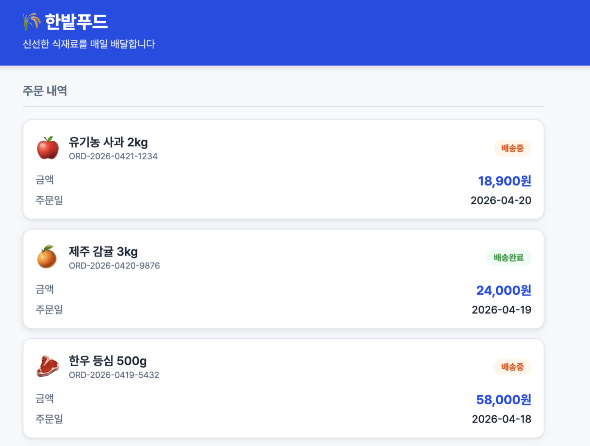
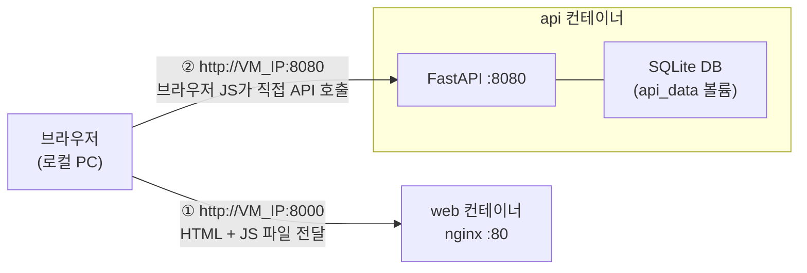

<span class="phase-badge">PHASE 1</span>
<span class="time-badge">예상 60분</span>

# AS-IS — 한밭푸드 사내 서버 둘러보기

## 이 실습에서 얻는 것

- 한밭푸드의 현재 운영 환경 체험
- 주문 조회 시스템의 실제 동작 방식 이해
- Docker Compose 기본 명령어 숙지

## 시나리오

여러분 앞에 있는 VM이 바로 **한밭푸드의 사내 서버**입니다.
여기서 주문 조회 시스템이 Docker Compose로 돌고 있어요.
먼저 띄워보고 어떻게 생겼는지 살펴봅시다.

---

## Step 1. 프로젝트 디렉터리 이동

```bash title="터미널"
cd ~/hanbat-order-app
ls -la
```

```console title="출력"
api/
scripts/
web/
docker-compose.yml
docker-compose.v2.yml
README.md
```

<div class="checkpoint">
<div class="checkpoint-title">✅ 확인 포인트</div>
<code>docker-compose.yml</code>, <code>web/</code>, <code>api/</code>, <code>scripts/</code> 폴더가 모두 보이나요?
</div>

### docker-compose.yml 살펴보기

```bash title="터미널"
cat docker-compose.yml
```

```yaml title="docker-compose.yml"
services:

  api:
    image: skilleat/hanbat-order-api:v1.0.0
    environment:
      - APP_VERSION=1.0.0
    ports:
      - "8080:8080"
    volumes:
      - api_data:/app/data
    restart: unless-stopped
    healthcheck:
      test:
        - "CMD"
        - "python"
        - "-c"
        - "import urllib.request; urllib.request.urlopen('http://localhost:8080/health')"
      interval: 30s
      timeout: 10s
      retries: 3

  web:
    image: skilleat/hanbat-order-web:v1.0.0
    environment:
      - API_URL=http://localhost:8080
    ports:
      - "8000:80"
    depends_on:
      - api
    restart: unless-stopped

volumes:
  api_data:
```

!!! info "이 시스템이 동작하는 방식"
    브라우저에서 `http://VM_IP:8000` 에 접속하면 아래 순서로 동작합니다.

    ```
    1. 브라우저  →  nginx(8000)  →  HTML + JS 파일 전달받음
    2. 브라우저가 받은 JS 실행
    3. JS 코드 안에 API_URL이 주입되어 있음 → 브라우저가 API 서버를 직접 호출
    4. 브라우저  →  API(8080)  →  주문 데이터 받아옴
    5. 화면에 주문 목록 표시
    ```

    즉 **nginx는 파일만 전달하고, 실제 데이터 조회는 브라우저가 직접 API 서버를 호출**합니다.

!!! warning "그래서 API_URL이 중요합니다"
    `API_URL`은 **브라우저가 API를 호출할 때 사용하는 주소**입니다.

    - `http://localhost:8080` → 브라우저 입장에서 `localhost`는 **사용자의 로컬 PC**를 의미합니다.
    - 클라우드 VM에 올라간 API 서버 주소가 아닙니다.
    - 따라서 **VM의 실제 공인 IP**로 바꿔줘야 브라우저가 API를 찾을 수 있습니다.

---

## Step 2. VM IP 확인 및 API_URL 설정

!!! danger "이 단계를 빠뜨리면 브라우저에서 주문 목록이 보이지 않습니다"

**VM의 공인 IP 확인:**

```bash title="터미널"
curl ifconfig.me
```

```console title="출력"
20.xxx.xxx.xxx
```

**`docker-compose.yml` 과 `docker-compose.v2.yml` 둘 다 수정 — `localhost` → VM 공인 IP:**

```bash title="터미널"
sed -i 's|API_URL=http://localhost:8080|API_URL=http://20.xxx.xxx.xxx:8080|' docker-compose.yml
sed -i 's|API_URL=http://localhost:8080|API_URL=http://20.xxx.xxx.xxx:8080|' docker-compose.v2.yml
```

`20.xxx.xxx.xxx` 부분을 위에서 확인한 실제 IP로 바꿔서 실행하세요.

!!! info "왜 두 파일 모두 수정해야 하나요?"
    `docker-compose.v2.yml`은 Phase 2에서 v2 배포 시 오버레이로 사용됩니다.
    이 파일에도 `API_URL`이 설정되어 있어, 수정하지 않으면 v2 배포 후 브라우저에서 `localhost:8080` 오류가 발생합니다.

수정 결과 확인:

```bash title="터미널"
grep API_URL docker-compose.yml docker-compose.v2.yml
```

```console title="출력"
docker-compose.yml:    - API_URL=http://20.xxx.xxx.xxx:8080
docker-compose.v2.yml: - API_URL=http://20.xxx.xxx.xxx:8080
```

---

## Step 3. 서비스 기동

```bash title="터미널"
docker compose up -d
```

!!! info "명령어 해설"
    `-d` 는 "detached mode" — 백그라운드 실행. 이미지가 로컬에 없으면 Docker Hub에서 자동으로 Pull합니다.

```console title="출력"
[+] Running 3/3
 [OK] Volume "hanbat-order-app_api_data"  Created
 [OK] Container hanbat-order-app-api-1    Started
 [OK] Container hanbat-order-app-web-1    Started
```

---

## Step 4. 컨테이너 상태 확인

```bash title="터미널"
docker compose ps
```

```console title="출력"
NAME                        IMAGE                              STATUS    PORTS
hanbat-order-app-api-1      skilleat/hanbat-order-api:v1.0.0  Up        0.0.0.0:8080->8080/tcp
hanbat-order-app-web-1      skilleat/hanbat-order-web:v1.0.0  Up        0.0.0.0:8000->80/tcp
```

<div class="checkpoint">
<div class="checkpoint-title">✅ 확인 포인트</div>
<code>api</code>와 <code>web</code> 컨테이너 모두 <strong>Up</strong> 상태인지 확인하세요.
</div>

---

## Step 5. 브라우저로 접속

로컬 PC 브라우저에서 아래 주소로 접속합니다.

```console title="브라우저 주소창"
http://VM_IP:8000
```

한밭푸드 주문 조회 화면이 보이면 성공입니다.



<div class="checkpoint">
<div class="checkpoint-title">✅ 확인 포인트</div>
주문 목록이 화면에 표시되나요? 화면 캡처를 저장해두세요 (평가 제출용).
</div>

---

## Step 6. API 직접 테스트

nginx를 거치지 않고 API 서버에 직접 요청을 보내볼 수 있습니다.
포트 8080이 외부에 열려 있기 때문입니다.

**헬스체크:**

```bash title="터미널"
curl http://localhost:8080/health
```

```json title="응답"
{"status": "ok", "version": "1.0.0", "orderCount": 10}
```

**주문 목록 조회:**

```bash title="터미널"
curl "http://localhost:8080/orders?userId=3030"
```

!!! tip "jq로 JSON을 보기 좋게 출력하기"
    `jq`는 JSON을 들여쓰기·색상 구분으로 예쁘게 출력해주는 CLI 도구입니다.

    설치:
    ```bash
    sudo apt-get install -y jq
    ```

    사용:
    ```bash
    curl -s "http://localhost:8080/orders?userId=3030" | jq .
    ```

```json title="응답"
{
  "data": [
    {
      "orderId": "ORD-001",
      "userId": 3030,
      "productName": "국내산 쌀 20kg",
      "amount": 58000,
      "status": "배송완료",
      "orderedAt": "2026-04-20T09:00:00"
    }
  ],
  "meta": {
    "version": "1.0.0",
    "containerInstanceId": "a1b2c3d4e5f6",
    "respondedAt": "2026-04-21T10:00:00",
    "processingTimeMs": 3
  }
}
```

!!! info "meta.containerInstanceId"
    요청을 처리한 컨테이너의 호스트명입니다. Phase 4에서 자동 확장이 동작하면 이 값이 여러 개로 바뀌는 것을 확인하게 됩니다.

!!! warning "API 포트 8080이 인터넷에 그대로 노출되어 있습니다"
    브라우저가 API를 직접 호출하는 구조이기 때문에 API 포트를 외부에 열 수밖에 없습니다.
    VM IP를 아는 사람이라면 누구나 `http://VM_IP:8080/orders?userId=3030` 을 직접 호출해 데이터를 볼 수 있습니다.
    ACA 이관 시 **Internal Ingress**로 이 문제를 해결합니다.

---

## Step 7. 버전 확인

```bash title="터미널"
curl http://localhost:8080/version
```

```json title="응답"
{
  "version": "1.0.0",
  "theme": "blue",
  "features": ["order_list", "order_detail"]
}
```

v2가 배포되면 `theme: green` 으로 바뀌고 배송 추적 기능이 추가됩니다. Phase 2에서 직접 확인합니다.

---

## Step 8. 로그 확인

```bash title="터미널"
docker compose logs -f api
```

실시간 로그가 출력됩니다. 종료는 `Ctrl+C`.

---

## Step 9. 지금 구조 정리



| 단계 | 설명 |
|------|------|
| ① | 브라우저가 nginx에 접속 → HTML/JS 파일을 받아옴 |
| ② | 받은 JS가 실행되면서 API 서버를 직접 호출 → 주문 데이터 받아옴 |
| 보안 문제 | API 포트 8080이 외부에 열려있어야 ②가 동작함 → 누구나 직접 접근 가능 |

---

<div class="checkpoint">
<div class="checkpoint-title">✅ Phase 1 완료 체크리스트</div>

- [ ] `docker-compose.yml`의 `API_URL`을 VM 공인 IP로 수정 <br>
- [ ] `docker compose up -d` 로 두 컨테이너 기동 성공 <br>
- [ ] 브라우저에서 `http://VM_IP:8000` 접속 — 주문 목록 확인 <br>
- [ ] `curl http://localhost:8080/health` — 정상 응답 확인 <br>
- [ ] `curl "http://localhost:8080/orders?userId=3030"` — 주문 데이터 확인 <br>
- [ ] 화면 캡처 저장 완료

</div>

---

## 자주 만나는 문제

<details>
<summary>docker compose up 중 "permission denied" 오류</summary>

```bash title="터미널"
sudo usermod -aG docker $USER
newgrp docker
```

이후 다시 `docker compose up -d` 실행.

</details>

<details>
<summary>브라우저에서 접속이 안 됩니다 (연결 거부)</summary>

```bash title="터미널"
docker compose ps                        # 컨테이너 상태 확인
sudo netstat -tlnp | grep 8000          # 포트 확인
sudo ufw status                         # 방화벽 확인
```

</details>

<details>
<summary>주문 목록이 비어있습니다</summary>

시드 데이터 생성에 10초 정도 걸립니다. 잠시 기다린 후 새로고침하세요.

```bash title="터미널"
curl http://localhost:8080/health
```

```json title="응답 — orderCount가 0이 아니면 정상"
{"status": "ok", "version": "1.0.0", "orderCount": 10}
```

</details>

<details>
<summary>주문 목록 화면이 뜨는데 데이터가 없습니다 (API 호출 실패)</summary>

`API_URL`이 올바르게 설정되었는지 확인하세요.

```bash title="터미널"
grep API_URL docker-compose.yml
```

`localhost` 가 아닌 VM 공인 IP로 설정되어 있어야 합니다. 수정 후 재시작:

```bash title="터미널"
docker compose up -d
```

</details>

---

## 다음 단계

<div class="nav-buttons">
<a href="../" class="nav-btn">← Phase 1 개요</a>
<a href="../../phase-2/" class="nav-btn next">Phase 2 · 고통 체험 →</a>
</div>
