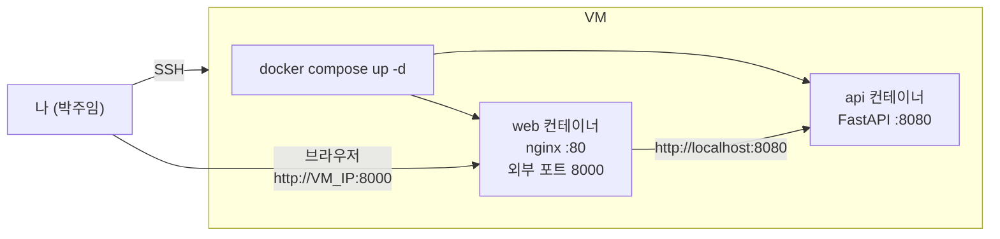

PHASE 1
예상 60분

# Phase 1 · AS-IS 체험

## 이 Phase에서 얻는 것

- 한밭푸드의 현재 운영 환경을 직접 체험
- 주문 조회 Web + API의 실제 동작 방식 이해
- Docker Compose 기본 명령어 숙지

## Phase 1 구성

| 단계 | 내용 | 소요 시간 |
|------|------|-----------|
| [AS-IS 환경 체험](as-is-docker-compose.md) | docker-compose 기동 · 동작 확인 | 60분 |

---

## 이 Phase의 목표 상태

---

<a href="../phase-0/environment-setup/" class="nav-btn">← Phase 0 완료</a>
<a href="as-is-docker-compose/" class="nav-btn next">AS-IS 체험 시작 →</a>

