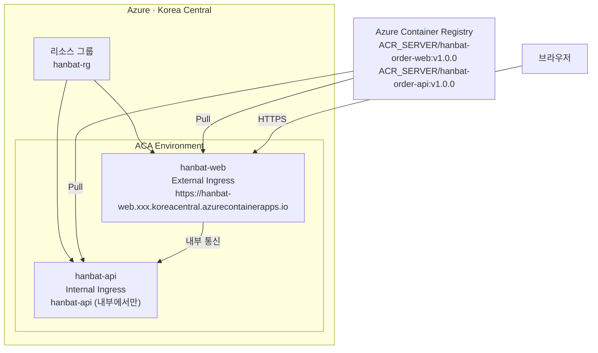

PHASE 3
예상 120분

# Phase 3 · 첫 이관

## 이 Phase에서 얻는 것

- Azure Container Registry(ACR) 생성 및 이미지 Push
- Azure Container Apps 환경(Environment) 생성
- Internal/External Ingress 개념과 설정
- ACA에서 Web + API 앱을 배포하고 접속 성공

## Phase 3 구성

| 단계 | 내용 | 소요 시간 |
|------|------|-----------|
| [ACR 생성 및 이미지 푸시](docker-hub-push.md) | ACR 생성 + 이미지 태그 + Push | 20분 |
| [ACA 환경 생성](environment-create.md) | Resource Group + ACA Environment | 20분 |
| [API 앱 배포](api-deploy.md) | Internal Ingress API 배포 | 40분 |
| [Web 앱 배포](web-deploy.md) | External Ingress Web 배포 + 접속 확인 | 40분 |

---

## Phase 3 목표 상태

Phase 3이 끝나면 브라우저에서 ACA URL로 주문 조회 화면에 접속할 수 있어야 합니다.

---

!!! warning "Azure 구독이 필요합니다"
    Phase 3부터는 실제 Azure 리소스를 생성합니다. 비용이 발생할 수 있으니 강의 종료 후 리소스 그룹을 삭제하는 것을 잊지 마세요.

---

<a href="../phase-2/pain-3-no-canary/" class="nav-btn">← Phase 2 완료</a>
<a href="docker-hub-push/" class="nav-btn next">ACR 생성 및 이미지 푸시 →</a>

