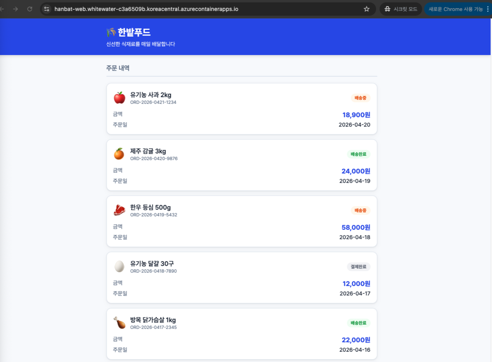

<span class="phase-badge">PHASE 3</span>
<span class="time-badge">예상 40분</span>

# Web 앱 배포 (External Ingress)

Web 앱은 **External Ingress**로 배포합니다 — 인터넷에서 HTTPS로 직접 접근 가능.

---

## Step 1. Web 앱 배포

1. Azure Portal → **Container Apps 환경** → **hanbat-env** → 왼쪽 메뉴 **Apps** → **+ 만들기**

2. **기본 사항** 탭:

   | 항목 | 값 |
   |------|-----|
   | 컨테이너 앱 이름 | `hanbat-web` |
   | 지역 | Korea Central |
   | Container Apps 환경 | `hanbat-env` (자동 선택됨) |

3. **컨테이너** 탭:

   | 항목 | 값 |
   |------|-----|
   | 이미지 | `<ACR_SERVER>/hanbat-order-web:v2.0.0` |
   | CPU 및 메모리 | 0.25 CPU, 0.5Gi |

   환경 변수:

   | 이름 | 값 |
   |------|-----|
   | `API_URL` | `/api` |

4. **수신(Ingress)** 탭:

   | 항목 | 값 |
   |------|-----|
   | 수신 | **사용** |
   | 수신 트래픽 | **어디서나** ← External |
   | 대상 포트 | `80` |

5. **검토 + 만들기** → **만들기**

!!! warning "반드시 v2.0.0을 사용하세요"
    v1.0.0은 nginx API 프록시 설정이 없어 주문 목록을 불러올 수 없습니다.

!!! danger "대상 포트는 80"
    Web 컨테이너(nginx)의 내부 포트는 **80**입니다. 8080을 입력하면 Health Check 실패로 앱이 계속 재시작됩니다.

!!! info "API 통신 구조"
    `hanbat-web`의 nginx가 `/api/*` 요청을 ACA 내부 `hanbat-api` 서비스로 프록시합니다.
    브라우저는 외부에서 내부 URL에 직접 접근할 수 없기 때문에 nginx가 중간에서 대신 전달합니다.

    ```
    브라우저 → https://hanbat-web.xxx/api/orders
               → nginx (hanbat-web 컨테이너)
               → http://hanbat-api/orders  (ACA 내부 통신)
    ```

    nginx는 같은 ACA 환경 내 앱을 **앱 이름만으로** 찾습니다 (`http://hanbat-api`).
    별도의 `API_BACKEND` 환경변수 설정 없이 자동으로 동작합니다.

---

## Step 2. 최소 복제본 수 확인

생성 완료 후 확인합니다.

1. **hanbat-web** 클릭 → 왼쪽 메뉴 **Scale** (규모 조정)
2. 현재 **Min replicas**: `0` — **그대로 둡니다**

!!! info "왜 web은 0으로 두나요?"
    `hanbat-web`은 min replicas = 0 상태로 실습합니다. 트래픽이 없으면 컨테이너가 꺼지고, 다시 접속하면 cold start가 발생합니다. 이 동작을 Step 4에서 직접 체험합니다.

---

## Step 3. URL 확인 및 브라우저 접속

1. **hanbat-web** → **Overview**
2. **Application Url** 복사
3. 브라우저 주소창에 붙여넣기 후 접속

한밭푸드 주문 조회 화면(파란 테마)이 나오면 성공입니다. Phase 3에서는 hanbat-api v1이 배포되어 파란 테마로 표시됩니다. 초록 테마는 Phase 4에서 v2로 업데이트 후 확인합니다.



---

## Step 4. 포털에서 앱 상태 확인

배포 후 포털에서 할 수 있는 것들을 하나씩 확인해봅니다.

### Log Stream — 컨테이너 로그 실시간 보기

앱이 정상 동작 중인지, 어떤 요청이 들어오는지 실시간으로 볼 수 있습니다.

1. **hanbat-web** → 왼쪽 메뉴 **Log stream**
2. 브라우저에서 화면을 새로고침
3. 로그에 HTTP 요청 로그가 출력되는 것을 확인

```console title="Log stream 출력 예시"
10.0.0.1 - - [21/Apr/2026:10:30:01 +0000] "GET / HTTP/1.1" 200 1234
10.0.0.1 - - [21/Apr/2026:10:30:01 +0000] "GET /api/orders HTTP/1.1" 200 567
```

!!! tip "오류 발생 시에도 여기서 확인"
    앱이 시작하지 않거나 API 연결이 실패할 때 Log stream에서 원인을 바로 확인할 수 있습니다.

### Metrics — 수치로 앱 상태 파악

1. **hanbat-web** → 왼쪽 메뉴 **Metrics**
2. 시간 범위: **최근 30분**
3. 아래 메트릭을 하나씩 선택해서 확인합니다

| Metric | 보여주는 것 |
|--------|-------------|
| **Replica Count** | 현재 컨테이너가 몇 개 떠있는지 |
| **Requests** | 초당 들어오는 요청 수 |
| **CPU Usage** | CPU 사용률 |
| **Memory Working Set Bytes** | 메모리 사용량 |

방금 접속했으므로 **Replica Count** 그래프에 **0 → 1** 로 올라가는 순간이 보일 겁니다.

---

## Step 5. Scale-to-Zero 직접 체험

### 지금 무슨 일이 일어난 걸까?

`hanbat-web`은 min replicas = **0**으로 배포됩니다.
즉, 아무도 접속하지 않으면 컨테이너가 **완전히 꺼집니다.** 비용도 0원.

URL을 처음 열었을 때 브라우저가 한참 빙글빙글 돌았다면, 그건 **오류가 아닙니다.**
ACA가 꺼져있던 컨테이너를 그 순간 다시 켜는 중이었던 겁니다.

```
아무도 없음 → replica 0 (컨테이너 꺼짐)
     ↓
URL 접속 요청 들어옴
     ↓
ACA: "누가 왔네, 컨테이너 켜야지"
     ↓
이미지 로드 → 앱 시작 → 응답 (수 초~수십 초)
     ↓
replica 1 (컨테이너 켜짐) → 화면 표시
```

이것을 **Cold Start(콜드 스타트)** 라고 합니다.

### 직접 실험해보기

**① 지금 Metrics에서 Replica Count 확인**

**hanbat-web** → **Metrics** → Metric: **Replica Count** → 시간 범위: **최근 30분**

그래프에 0 → 1로 올라간 순간이 보입니다.

**② 300초 기다리기**

터미널에서 카운트다운을 돌려두고 자리를 비웁니다:

```bash title="터미널"
for i in $(seq 300 -1 1); do echo "$i초 남음"; sleep 1; done && echo "완료! 이제 Metrics 확인하세요"
```

**③ 300초 후 Metrics 다시 확인**

그래프에서 **1 → 0** 으로 내려간 구간이 보입니다.
그 상태에서 URL을 다시 열면 — 브라우저가 또 한참 도는 걸 직접 느낄 수 있습니다.

!!! info "300초(5분)가 기본 Cool-down 시간입니다"
    마지막 요청 후 300초 동안 추가 트래픽이 없으면 replica가 0으로 내려갑니다.
    이 값은 KEDA 스케일 규칙에서 조정할 수 있습니다.

!!! tip "실제 서비스라면?"
    Cold Start 지연이 문제가 된다면 **Scale → Min replicas = 1** 로 설정해 항상 1개를 유지합니다.
    비용과 응답속도 사이의 트레이드오프입니다.

    | 설정 | 비용 | 응답속도 |
    |------|------|----------|
    | `min replicas = 0` | 절감 (유휴 시 0원) | cold start 발생 |
    | `min replicas = 1` | 최소 비용 발생 | 항상 즉시 응답 |

---

<div class="checkpoint">
<div class="checkpoint-title">✅ Phase 3 완료 체크리스트</div>

- [ ] `hanbat-api` — Internal Ingress, Running, 대상 포트 8080
<br>
- [ ] `hanbat-web` — External Ingress, Running, 대상 포트 80, 이미지 v2.0.0
<br>
- [ ] `https://hanbat-web.xxx.azurecontainerapps.io` 접속 성공
<br>
- [ ] 주문 목록이 화면에 표시됨 (파란 테마, v1)
<br>
- [ ] 화면 캡처 저장 (평가 A-1, A-2)

</div>

---

## 자주 만나는 문제

<details>
<summary>주문 목록이 비어있습니다 (API 연결 실패)</summary>

브라우저 개발자도구(F12) → Network 탭에서 `/orders` 요청이 실패하는지 확인하세요.

`API_URL` 환경 변수가 올바른지 확인:

```bash title="터미널"
az containerapp show \
  --name hanbat-web \
  --resource-group $RESOURCE_GROUP \
  --query "properties.template.containers[0].env"
```

`API_URL` 이 `/api` 로 설정되어 있어야 합니다.

</details>

<details>
<summary>브라우저에서 "사이트에 연결할 수 없음"</summary>

1. URL이 `https://` 로 시작하는지 확인
2. Ingress가 External인지 확인:

```bash title="터미널"
az containerapp ingress show \
  --name hanbat-web \
  --resource-group $RESOURCE_GROUP \
  --query "external"
# true 여야 함
```

</details>

---

<div class="nav-buttons">
<a href="../api-deploy/" class="nav-btn">← API 앱 배포</a>
<a href="../../phase-4/" class="nav-btn next">Phase 4 · 재경기 →</a>
</div>
