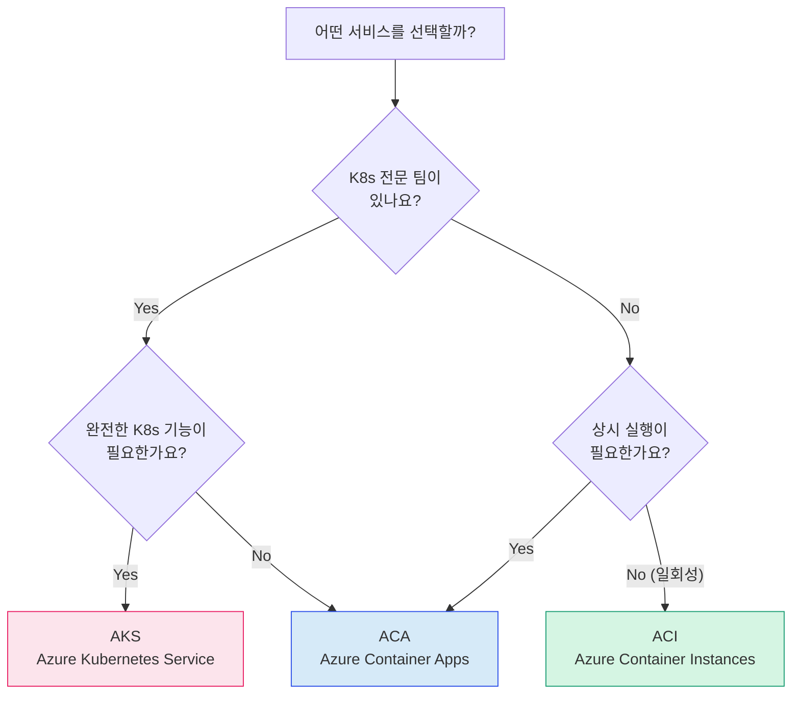

PHASE 5
예상 30분

# 비교 매트릭스: ACA vs AKS vs ACI

---

## 먼저 혼자 채워보기

아래 표의 빈칸을 **먼저 스스로 채워보세요**. 실습하면서 얻은 지식을 정리하는 과정입니다.
완성본은 아래 탭에서 확인할 수 있습니다.

=== "빈칸 (먼저 채워보기)"

    | 비교 항목 | ACA | AKS | ACI |
    |-----------|-----|-----|-----|
    | 관리 부담 | | | |
    | 자동 확장 | | | |
    | 무중단 배포 | | | |
    | Kubernetes 지식 필요 여부 | | | |
    | 비용 모델 | | | |
    | 최소 운영 가능 팀 규모 | | | |
    | 네트워킹 유연성 | | | |
    | 적합한 워크로드 | | | |

=== "완성본 (정답 확인)"

    | 비교 항목 | ACA | AKS | ACI |
    |-----------|-----|-----|-----|
    | 관리 부담 | 낮음 (완전 관리형) | 높음 (클러스터 직접 관리) | 매우 낮음 |
    | 자동 확장 | KEDA 내장 (자동) | 직접 HPA/KEDA 설정 | 없음 (수동) |
    | 무중단 배포 | Revision 기반 (내장) | Rolling Update (직접 설정) | 없음 |
    | K8s 지식 필요 여부 | 불필요 (추상화됨) | 필수 | 불필요 |
    | 비용 모델 | vCPU/메모리 사용량 기반 | 노드 VM 시간 기반 | 컨테이너 시간 기반 |
    | 최소 운영 팀 규모 | 1~2명 | 3명 이상 권장 | 1명 |
    | 네트워킹 유연성 | 중간 (VNet 통합 가능) | 높음 (완전한 K8s 네트워킹) | 낮음 |
    | 적합한 워크로드 | 웹 앱, API, 마이크로서비스 | 복잡한 MSA, 고급 네트워킹 | 일회성 작업, Batch |

---

## 선택 가이드

---

## 한밭푸드 맥락에서의 권장안

### 조건 정리

| 항목 | 한밭푸드 상황 |
|------|-------------|
| 인프라팀 규모 | 3명 (K8s 경험 없음) |
| 예산 | 월 50만 원 이내 |
| 워크로드 | 웹 앱 + API (상시 실행) |
| 요구사항 | 무중단 배포, 자동 확장, 점진 배포 |
| 향후 계획 | 마이크로서비스 점진 전환 |

### 권장: Azure Container Apps

=== "권장 이유"

    1. **K8s 경험 없이도 운영 가능**: 인프라팀 3명이 Kubernetes를 배우는 데는 수개월이 걸림. ACA는 지금 당장 사용 가능.
    2. **비용 효율**: 사용량 기반 과금으로 트래픽이 없는 시간대에는 비용 최소화. 월 50만 원 이내 가능.
    3. **요구사항 충족**: 무중단 배포(Revision), 자동 확장(KEDA), 점진 배포(Traffic Split) 모두 기본 지원.
    4. **마이크로서비스 확장 유리**: 향후 서비스가 늘어나도 ACA 환경에 추가 배포만 하면 됨.

=== "AKS는 언제?"

    한밭푸드가 AKS를 고려해야 하는 시점:

    - K8s 전문 엔지니어를 채용했을 때
    - 서비스 수가 20개 이상으로 늘어 ACA 한계를 느낄 때
    - 커스텀 네트워킹, 서비스 메시(Istio), GPU 워크로드가 필요할 때
    - 멀티 클러스터, 하이브리드 환경이 필요할 때

=== "ACI는 언제?"

    한밭푸드에서 ACI를 활용할 수 있는 경우:

    - 배치 작업 (야간 정산, 리포트 생성)
    - CI/CD 파이프라인의 빌드 단계
    - 임시 데이터 처리 작업

---

## 토론 질문

!!! question "여러분 회사라면?"

    여러분이 실제로 근무하는 (또는 근무했던) 회사를 떠올려보세요.

    1. 그 회사의 인프라 상황은 어떤가요?
    2. ACA, AKS, ACI 중 어떤 선택이 적합할까요?
    3. 그 이유를 한밭푸드 의사결정 프레임워크로 설명해보세요.

    옆 사람과 3분간 토론해보세요.

---

✅ Phase 5 완료 체크리스트

- [ ] 비교 매트릭스 빈칸 직접 채우기 완료
- [ ] 세 서비스 선택 기준 이해
- [ ] 한밭푸드 권장안 근거 설명 가능
- [ ] 완성한 비교 매트릭스 문서 저장 (평가 C-1)

---

<a href="../" class="nav-btn">← Phase 5 개요</a>
<a href="../../evaluation/" class="nav-btn next">평가 안내 →</a>

